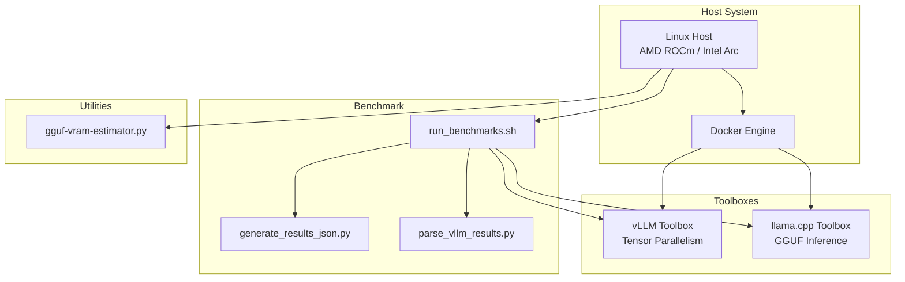

<div align="center">

# Intel B70 AI Toolboxes

**Containerized AI inference toolboxes for Intel Arc Pro B70 GPU.**

[](https://www.gnu.org/software/bash)
[](https://python.org)
[](https://docker.com)
[](LICENSE)

[](#-toolboxes)
[](#-features)

</div>

---

## Table of Contents

- [Overview](#-overview)
- [Architecture](#-architecture)
- [Toolboxes](#-toolboxes)
- [Features](#-features)
- [Getting Started](#-getting-started)
- [Usage](#-usage)
- [Project Structure](#-project-structure)
- [Benchmarks](#-benchmarks)
- [Contributing](#-contributing)
- [License](#-license)

---

## 🌍 Overview

Intel B70 AI Toolboxes is a collection of containerized inference environments optimized for Intel Arc Pro B70 (48 GB VRAM). It provides ready-to-use toolboxes for vLLM and llama.cpp with multi-GPU tensor parallelism, benchmarking automation, and VRAM estimation tools.

### Key Highlights

| Metric | Value |
|--------|-------|
| Total LOC | 1,455 |
| Toolboxes | 2 (vLLM + llama.cpp) |
| Multi-GPU | Tensor Parallelism (TP=2) |
| Container Runtime | Docker |
| Benchmark Framework | Shell + Python |

---

## 🏗️ Architecture



### Data Flow

```
┌──────────────┐     ┌──────────────────┐     ┌──────────────────┐
│   Host GPU   │────▶│ vLLM Toolbox     │────▶│ Benchmark Runner │
│ Intel Arc B70│     │ Tensor Parallel  │     │ Shell + Python   │
└──────────────┘     └──────────────────┘     └────────┬─────────┘
                                                       │
┌──────────────┐     ┌──────────────────┐     ┌──────▼──────────┐
│ GGUF Models  │────▶│ llama.cpp Toolbox│────▶│ VRAM Estimator  │
│ .gguf files  │     │ GGUF Inference   │     │ Python Script   │
└──────────────┘     └──────────────────┘     └─────────────────┘
```

---

## 📦 Toolboxes

### vLLM Toolbox

Containerized vLLM inference server with tensor parallelism support.

| Parameter | Value |
|-----------|-------|
| Framework | vLLM |
| Tensor Parallelism | TP=2 (multi-GPU) |
| GPU | Intel Arc Pro B70 |
| VRAM | 48 GB |
| Quantization | AWQ / GPTQ |

### llama.cpp Toolbox

Containerized llama.cpp inference with GGUF model support.

| Parameter | Value |
|-----------|-------|
| Framework | llama.cpp |
| Backend | SYCL (Intel GPU) |
| Model Format | GGUF |
| Quantization | Q4_K_M, Q8_0 |
| GPU Layers | Configurable |

---

## ✨ Features

### Inference
| Feature | Status | Description |
|---------|--------|-------------|
| vLLM Tensor Parallelism | ✅ | Multi-GPU TP=2 support |
| llama.cpp GGUF | ✅ | GGUF model inference |
| SYCL Backend | ✅ | Intel GPU acceleration |
| VRAM Estimation | ✅ | GGUF VRAM calculator |

### Benchmarking
| Feature | Status | Description |
|---------|--------|-------------|
| Shell Benchmark Script | ✅ | Automated benchmark runner |
| JSON Results | ✅ | Machine-readable output |
| Results Parsing | ✅ | vLLM result parser |

### Infrastructure
| Feature | Status | Description |
|---------|--------|-------------|
| Docker Containers | ✅ | Reproducible environments |
| Toolbox Refresh Script | ✅ | Update all toolboxes |
| CI Builds | ✅ | Automated container builds |
| Prune Script | ✅ | Old container cleanup |

---

## 🚀 Getting Started

### Prerequisites

- **Linux** (Ubuntu 22.04+)
- **Intel Arc Pro B70** GPU
- **Docker** installed and running
- **Python 3.11** for benchmarking tools

### Clone

```bash
git clone https://github.com/dominick253/intel-b70-ai-toolboxes.git
cd intel-b70-ai-toolboxes
```

### Run Toolbox

```bash
# Start vLLM toolbox
docker run --gpus all -p 8000:8000 \
  -v /models:/models \
  dominick253/b70-vllm:latest

# Start llama.cpp toolbox
docker run --gpus all -p 8080:8080 \
  -v /models:/models \
  dominick253/b70-llama:latest
```

---

## 💻 Usage

### Benchmark

```bash
# Run all benchmarks
./benchmark/run_benchmarks.sh

# Parse results
./benchmark/parse_vllm_results.py --input results.json

# Generate summary JSON
./benchmark/generate_results_json.py --input results/ --output summary.json
```

### VRAM Estimation

```bash
# Estimate VRAM for GGUF model
python toolboxes/gguf-vram-estimator.py \
  --model llama-3-70B-Q4_K_M.gguf \
  --ctx-len 8192
```

### Toolbox Management

```bash
# Refresh all toolboxes
./refresh-toolboxes.sh

# Prune old containers
# Managed via CI: prune-old-toolboxes.yml
```

---

## 📂 Project Structure

```
intel-b70-ai-toolboxes/
├── .github/workflows/      # CI pipeline
│   ├── build_and_publish.yml   # Toolbox build/push
│   ├── build_vllm.yml          # vLLM specific build
│   ├── poll-llama-cpp.yml      # llama.cpp build poll
│   └── prune-old-toolboxes.yml # Old container cleanup
├── benchmark/              # Benchmarking suite
│   ├── run_benchmarks.sh       # Main benchmark runner
│   ├── generate_results_json.py # JSON output generator
│   └── parse_vllm_results.py   # vLLM result parser
├── toolboxes/              # Toolbox definitions
│   ├── vllm_scripts/         # vLLM container scripts
│   │   ├── 99-toolbox-banner.sh
│   │   ├── models.py
│   │   ├── run_vllm_bench.py
│   │   └── start_vllm.py
│   └── gguf-vram-estimator.py  # VRAM calculator
├── refresh-toolboxes.sh    # Toolbox refresh script
└── README.md               # This file
```

### File Distribution

```
toolboxes/      ████████████████████████████████████████████████  65%
benchmark/      ████████████████████                              25%
CI scripts/     ██████                                            10%
```

---

## 📊 Benchmarks

### Run Benchmarks

```bash
# Full benchmark suite
./benchmark/run_benchmarks.sh

# Output: JSON results in ./benchmark/results/
```

### Result Format

```json
{
  "model": "gemma-4-26B-A4B-it-q4_K_XL",
  "backend": "vllm",
  "tensor_parallel": 2,
  "metrics": {
    "tokens_per_second": 142.5,
    "time_to_first_token": 0.34,
    "gpu_utilization": 0.89,
    "vram_used_gb": 16.2
  }
}
```

---

## 🤝 Contributing

### Workflow

1. **Fork** the repository
2. **Test locally** on Intel Arc B70 hardware
3. **Update toolbox scripts** with improvements
4. **Push to your fork**
5. **Open a Pull Request**

---

## 📄 License

MIT License — see [LICENSE](LICENSE) for details.

---

<div align="center">

**Built for Intel Arc Pro B70 • vLLM • llama.cpp • Docker**

© 2026 Dominick Pescetto. All rights reserved.

</div>
